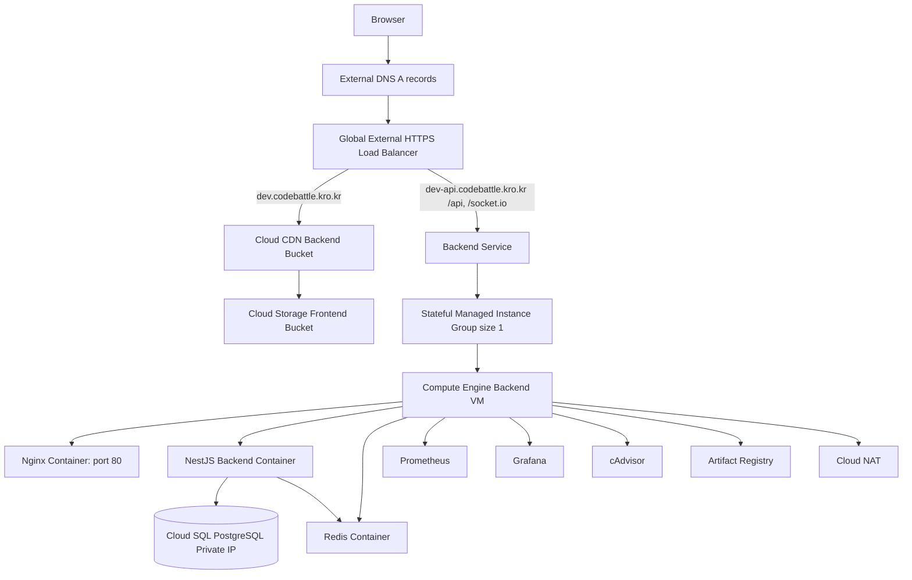

# GCP Dev 배포 Runbook

## 1. 목적

이 문서는 `gcp-dev` 환경을 처음부터 생성하고 애플리케이션을 배포할 때 사용한 실제 절차와 트러블슈팅을 정리한다.

범위는 다음과 같다.

- Terraform으로 GCP dev 인프라 생성
- Cloud SQL 사용자와 애플리케이션 DB 연결 준비
- Backend Docker image build/push
- Compute Engine VM에 Docker Compose 기반 backend stack 배포
- Frontend build 산출물 Cloud Storage 업로드
- DNS, SSL, OAuth, WebSocket 검증
- dev bring-up 과정에서 발생한 오류와 해결 방법

## 2. Dev 기준 값

현재 dev 환경은 다음 값을 기준으로 구성한다.

| 항목 | 값 |
| --- | --- |
| GCP project ID | `cmctv-500213` |
| Region | `asia-northeast3` |
| Zone | `asia-northeast3-a` |
| Frontend domain | `dev.codebattle.kro.kr` |
| API domain | `dev-api.codebattle.kro.kr` |
| Terraform env | `terraform/envs/gcp-dev` |
| Terraform state bucket | `cmctv-500213-cmc-tfstate` |
| Frontend bucket | `cmctv-500213-cmc-dev-frontend` |
| Artifact Registry repository | `asia-northeast3-docker.pkg.dev/cmctv-500213/cmc` |
| Backend image tag | `asia-northeast3-docker.pkg.dev/cmctv-500213/cmc/backend:dev-latest` |
| Cloud SQL instance | `cmc-dev-postgres` |
| Cloud SQL database | `cmc` |
| Cloud SQL private IP | Terraform output `cloud_sql_private_ip` |
| Backend VM directory | `/opt/cmc` |
| Backend compose file | `docker-compose-prod.yml` |

## 3. 아키텍처



핵심 경계는 다음과 같다.

- GCP Load Balancer에서 TLS를 종료한다.
- VM 내부 Nginx는 HTTP `80`만 받는다.
- Frontend는 Cloud Storage/Cloud CDN에서 정적 파일로 제공한다.
- API와 WebSocket은 `dev-api.codebattle.kro.kr`로 분리한다.
- Backend는 아직 완전한 stateless 구조가 아니므로 MIG size는 `1`로 유지하고 boot disk를 stateful policy로 보존한다.

## 4. 사전 준비

### 4.1 GCP 인증

로컬 터미널에서 Terraform과 `gcloud`가 같은 프로젝트를 보도록 설정한다.

```bash
gcloud auth login
gcloud auth application-default login
gcloud config set project cmctv-500213
```

### 4.2 Terraform state bucket

`gcp-dev`는 GCS remote backend를 사용한다. bucket이 없으면 먼저 생성한다.

```bash
gcloud storage buckets create gs://cmctv-500213-cmc-tfstate \
  --project cmctv-500213 \
  --location asia-northeast3 \
  --uniform-bucket-level-access

gcloud storage buckets update gs://cmctv-500213-cmc-tfstate \
  --versioning
```

### 4.3 Terraform 변수 파일

`terraform.tfvars`는 민감하거나 환경별 값이므로 Git에 올리지 않는다. 예시는 다음과 같다.

```bash
cd /Users/steve/naverBoostCamp/cmc/web02-CMC/terraform/envs/gcp-dev
cp terraform.tfvars.example terraform.tfvars
```

dev 기준 값:

```hcl
gcp_project_id = "cmctv-500213"
owner          = "cmc"

root_domain          = "codebattle.kro.kr"
frontend_subdomain   = "dev"
api_subdomain        = "dev-api"
frontend_bucket_name = "cmctv-500213-cmc-dev-frontend"

managed_zone_name = "codebattle-kro-kr"

create_dns_zone    = false
create_dns_records = false
admin_access_cidrs = []

# /livez 배포와 검증이 끝날 때까지 false로 유지한다.
backend_autohealing_enabled = false
```

DNS는 현재 Terraform이 아니라 외부 DNS에서 수동 A record로 관리한다.

## 5. Terraform apply

### 5.1 초기화

```bash
cd terraform/envs/gcp-dev

terraform init \
  -backend-config="bucket=cmctv-500213-cmc-tfstate" \
  -backend-config="prefix=cmc/gcp-dev"
```

### 5.2 plan/apply

기존 VM을 stateful MIG로 전환하는 경우에는 `backend_autohealing_enabled = false`인지 먼저 확인하고, 반드시 [17. Stateful MIG 적용 순서](#17-stateful-mig-적용-순서)를 따른다. 이 값이 `false`여도 stateful disk 정책과 `/livez` health check 리소스는 만들지만 auto-healing 정책은 MIG에 연결하지 않는다.

```bash
cd /Users/steve/naverBoostCamp/cmc/web02-CMC
terraform fmt -recursive terraform/envs/gcp-dev terraform/modules

cd terraform/envs/gcp-dev
terraform validate
terraform plan
terraform apply
```

정상 apply 후 주요 output을 확인한다.

```bash
terraform output
terraform output -raw load_balancer_ip
terraform output -raw cloud_sql_private_ip
terraform output -raw cloud_sql_connection_name
terraform output -raw artifact_registry_docker_repository_url
```

dev 검증 당시 output 예시는 다음과 같다.

```text
api_domain = "dev-api.codebattle.kro.kr"
frontend_domain = "dev.codebattle.kro.kr"
load_balancer_ip = "34.111.159.68"
frontend_bucket_name = "cmctv-500213-cmc-dev-frontend"
artifact_registry_docker_repository_url = "asia-northeast3-docker.pkg.dev/cmctv-500213/cmc"
cloud_sql_connection_name = "cmctv-500213:asia-northeast3:cmc-dev-postgres"
cloud_sql_private_ip = "10.221.0.3"
```

## 6. DNS와 SSL 확인

### 6.1 DNS A record 설정

외부 DNS에서 다음 A record를 Load Balancer IP로 연결한다.

| Host | Type | Value |
| --- | --- | --- |
| `dev.codebattle.kro.kr` | `A` | `terraform output -raw load_balancer_ip` |
| `dev-api.codebattle.kro.kr` | `A` | `terraform output -raw load_balancer_ip` |

확인:

```bash
dig @8.8.8.8 +short dev.codebattle.kro.kr A
dig @8.8.8.8 +short dev-api.codebattle.kro.kr A
```

### 6.2 Managed SSL certificate 확인

인증서 이름은 domain set hash가 붙는다. 현재 이름은 Terraform state 또는 `gcloud`로 확인한다.

```bash
gcloud compute ssl-certificates list \
  --project cmctv-500213 \
  --global \
  --filter='name~cmc-dev-cert'
```

상태 확인:

```bash
CERT_NAME=$(gcloud compute ssl-certificates list \
  --project cmctv-500213 \
  --global \
  --filter='name~cmc-dev-cert' \
  --format='value(name)' | head -n 1)

gcloud compute ssl-certificates describe "$CERT_NAME" \
  --project cmctv-500213 \
  --global \
  --format='get(managed.status,managed.domainStatus)'
```

`ACTIVE`가 되어야 HTTPS 브라우저 접속이 정상화된다.

## 7. Cloud SQL 사용자 준비

Terraform은 DB instance와 database까지만 생성한다. DB password는 state에 남기지 않기 위해 별도로 생성한다.

```bash
DB_PASSWORD="$(openssl rand -base64 32)"

gcloud sql users create cmc_user \
  --project cmctv-500213 \
  --instance cmc-dev-postgres \
  --password "$DB_PASSWORD"
```

`DATABASE_URL`은 VM의 `/opt/cmc/.env`에서 사용한다.

```text
postgresql://cmc_user:<DB_PASSWORD>@<CLOUD_SQL_PRIVATE_IP>:5432/cmc?schema=public
```

## 8. Backend image build/push

GCP VM은 `linux/amd64` 환경이다. Apple Silicon 로컬에서 그대로 build하면 VM에서 pull은 되더라도 실행 가능한 manifest가 없을 수 있으므로 반드시 platform을 지정한다.

```bash
cd /Users/steve/naverBoostCamp/cmc/web02-CMC

IMAGE=asia-northeast3-docker.pkg.dev/cmctv-500213/cmc/backend

gcloud auth configure-docker asia-northeast3-docker.pkg.dev

docker buildx create --use --name cmc-builder || docker buildx use cmc-builder

docker buildx build \
  --platform linux/amd64 \
  -f backend/Dockerfile \
  -t "$IMAGE:dev-latest" \
  --push \
  .
```

## 9. Backend VM 배포

### 9.1 MIG의 단일 VM 확인

prefix 전역 검색을 사용하지 않고 정확한 MIG 안의 VM을 조회한다. 결과가 한 대가 아니거나 `RUNNING/NONE` 상태가 아니면 배포하지 않는다.

```bash
PROJECT_ID=cmctv-500213
REGION=asia-northeast3
MIG=cmc-dev-backend

gcloud compute instance-groups managed list-instances "$MIG" \
  --project "$PROJECT_ID" \
  --region "$REGION" \
  --format='table(name,instance.scope().segment(0),instanceStatus,currentAction)'
```

배포 workflow와 `.github/scripts/deploy-gcp-backend.sh`가 이 검사를 자동으로 수행한다.

### 9.2 배포 디렉터리 생성

```bash
gcloud compute ssh "$INSTANCE" \
  --project "$PROJECT_ID" \
  --zone "$ZONE" \
  --tunnel-through-iap \
  --command 'sudo mkdir -p /opt/cmc && sudo chown "$USER:$USER" /opt/cmc'
```

### 9.3 Compose/Nginx/Monitoring 파일 업로드

```bash
cd /Users/steve/naverBoostCamp/cmc/web02-CMC

gcloud compute scp --recurse \
  docker-compose-prod.yml nginx monitoring \
  "$INSTANCE:/opt/cmc/" \
  --project "$PROJECT_ID" \
  --zone "$ZONE" \
  --tunnel-through-iap
```

### 9.4 VM `.env` 작성

VM에 접속한다.

```bash
gcloud compute ssh "$INSTANCE" \
  --project "$PROJECT_ID" \
  --zone "$ZONE" \
  --tunnel-through-iap
```

`/opt/cmc/.env`를 작성한다. 값에 특수문자가 있어도 `.env`에서는 일반적으로 따옴표 없이 쓴다. 공백이나 `#`가 포함될 때만 따옴표를 사용한다.

```bash
cd /opt/cmc
nano .env
```

필수 값:

```dotenv
BACKEND_IMAGE=asia-northeast3-docker.pkg.dev/cmctv-500213/cmc/backend
VERSION_TAG=dev-latest

NODE_ENV=production
PORT=3000
GF_SECURITY_ADMIN_PASSWORD=<strong-random-password>

FRONTEND_URL=https://dev.codebattle.kro.kr
DATABASE_URL=postgresql://cmc_user:<DB_PASSWORD>@<CLOUD_SQL_PRIVATE_IP>:5432/cmc?schema=public

REDIS_HOST=redis
REDIS_PORT=6379

JWT_ACCESS_SECRET=<random-secret>
JWT_REFRESH_SECRET=<random-secret>
JWT_ACCESS_EXPIRES_IN=15m
JWT_REFRESH_EXPIRES_IN=14d

GEMINI_API_KEYS=<gemini-api-key>

GITHUB_CLIENT_ID=<github-oauth-client-id>
GITHUB_CLIENT_SECRET=<github-oauth-client-secret>
GITHUB_CALLBACK_URL=https://dev-api.codebattle.kro.kr/api/auth/github/callback

KAKAO_CLIENT_ID=<kakao-rest-api-key>
KAKAO_CLIENT_SECRET=<kakao-client-secret>
KAKAO_CALLBACK_URL=https://dev-api.codebattle.kro.kr/api/auth/kakao/callback
```

### 9.5 Artifact Registry pull 인증

배포 명령을 `sudo docker compose`로 실행하면 root Docker config에 인증이 필요하다.

```bash
gcloud auth print-access-token | sudo docker login \
  -u oauth2accesstoken \
  --password-stdin https://asia-northeast3-docker.pkg.dev
```

### 9.6 migration 실행과 컨테이너 기동

```bash
cd /opt/cmc

sudo docker compose -f docker-compose-prod.yml pull
sudo docker compose -f docker-compose-prod.yml run --rm migrate
sudo docker compose -f docker-compose-prod.yml up -d
sudo docker compose -f docker-compose-prod.yml ps
sudo docker compose -f docker-compose-prod.yml logs -f backend
```

## 10. API 검증

HTTP는 HTTPS로 redirect되어야 한다.

```bash
curl -i http://dev-api.codebattle.kro.kr/healthz
```

HTTPS health check:

```bash
curl -i https://dev-api.codebattle.kro.kr/healthz
```

기대값:

```json
{"status":"ready"}
```

`/healthz`는 Cloud SQL에 `SELECT 1`, Redis에 `PING`을 실행하며 하나라도 실패하거나 제한 시간을 넘으면 `503`을 반환한다. 원인은 다음 순서로 확인한다.

```bash
cd /opt/cmc
sudo docker compose -f docker-compose-prod.yml logs --tail=200 backend
sudo docker compose -f docker-compose-prod.yml exec -T redis redis-cli ping
```

DB 연결은 VM의 `.env`에 있는 `DATABASE_URL`, Cloud SQL private IP, 방화벽/Private Service Access를 함께 확인한다.

MIG auto-healing용 liveness는 외부 DB/Redis를 확인하지 않는다.

```bash
curl -i https://dev-api.codebattle.kro.kr/livez
```

기대 body는 `{"status":"alive"}`다.

API root:

```bash
curl -i https://dev-api.codebattle.kro.kr/api
```

`/api`가 `http://.../api/`로 redirect되면 `nginx/nginx.conf`의 exact `location = /api`가 VM에 반영되지 않은 것이다. 파일을 다시 업로드하고 Nginx를 재시작한다.

```bash
gcloud compute scp --recurse nginx \
  "$INSTANCE:/opt/cmc/" \
  --project "$PROJECT_ID" \
  --zone "$ZONE" \
  --tunnel-through-iap

gcloud compute ssh "$INSTANCE" \
  --project "$PROJECT_ID" \
  --zone "$ZONE" \
  --tunnel-through-iap \
  --command 'cd /opt/cmc && sudo docker compose -f docker-compose-prod.yml up -d nginx'
```

## 11. Frontend build/upload

### 11.1 Build

Frontend 코드는 `VITE_API_URL` 뒤에 `/api/...`를 직접 붙인다. 따라서 `VITE_API_URL`에는 `/api`를 붙이지 않는다.

```bash
cd /Users/steve/naverBoostCamp/cmc/web02-CMC

pnpm -C packages/types build

VITE_API_URL=https://dev-api.codebattle.kro.kr \
VITE_SOCKET_URL=https://dev-api.codebattle.kro.kr \
VITE_ENABLE_SENTRY=false \
pnpm -C frontend build
```

### 11.2 Upload

```bash
BUCKET=cmctv-500213-cmc-dev-frontend

gcloud storage rm -r "gs://$BUCKET/**" || true

gcloud storage cp -r frontend/dist/* "gs://$BUCKET/" \
  --cache-control="public, max-age=31536000, immutable"

gcloud storage cp frontend/dist/index.html "gs://$BUCKET/index.html" \
  --cache-control="no-cache, no-store, must-revalidate"
```

브라우저에서 `https://dev.codebattle.kro.kr` 접속 후 다음을 확인한다.

- 화면 렌더링
- API 요청이 `https://dev-api.codebattle.kro.kr/api/...`로 나가는지
- WebSocket 요청이 `https://dev-api.codebattle.kro.kr/socket.io/...`로 나가는지
- OAuth 로그인 callback이 dev API domain으로 돌아오는지

## 12. OAuth 설정

### 12.1 GitHub

GitHub OAuth App의 callback URL:

```text
https://dev-api.codebattle.kro.kr/api/auth/github/callback
```

### 12.2 Kakao

Kakao Developers에 등록할 Redirect URI:

```text
https://dev-api.codebattle.kro.kr/api/auth/kakao/callback
```

`KAKAO_CLIENT_ID`는 JavaScript key나 Admin key가 아니라 REST API key를 사용한다.

## 13. 최종 완료 체크리스트

- `terraform plan` 결과가 의도한 변경 없음인지 확인
- `dig @8.8.8.8 +short dev.codebattle.kro.kr A`가 Load Balancer IP를 반환
- `dig @8.8.8.8 +short dev-api.codebattle.kro.kr A`가 Load Balancer IP를 반환
- Google-managed SSL certificate 상태가 `ACTIVE`
- `curl -i https://dev-api.codebattle.kro.kr/healthz`가 `200` 반환
- `curl -i https://dev-api.codebattle.kro.kr/livez`가 `200` 반환
- `curl -i https://dev-api.codebattle.kro.kr/api`가 예상 응답 반환
- `sudo docker compose -f docker-compose-prod.yml ps`에서 컨테이너가 정상 상태
- backend log에 반복 crash가 없음
- `https://dev.codebattle.kro.kr` 브라우저 접속 성공
- OAuth 로그인 성공
- WebSocket 연결 성공

## 14. 트러블슈팅

### 14.1 Cloud SQL `Invalid Tier (db-f1-micro) for (ENTERPRISE_PLUS) Edition`

증상:

```text
Invalid Tier (db-f1-micro) for (ENTERPRISE_PLUS) Edition
```

원인:

- PostgreSQL 16 Cloud SQL instance 생성 시 edition 기본값이 `ENTERPRISE_PLUS`로 해석될 수 있다.
- `db-f1-micro`는 `ENTERPRISE_PLUS` tier가 아니다.

해결:

- `settings.edition = "ENTERPRISE"`를 명시한다.
- 현재 Terraform은 `cloud_sql_edition = "ENTERPRISE"` 기본값으로 처리한다.

### 14.2 Managed SSL certificate `FAILED_NOT_VISIBLE`

증상:

```text
PROVISIONING dev-api.example.com=FAILED_NOT_VISIBLE
```

원인:

- 인증서 domain의 A record가 Load Balancer IP를 가리키지 않는다.
- DNS 전파가 아직 끝나지 않았다.
- 도메인 오타가 있다.

해결:

```bash
dig @8.8.8.8 +short dev.codebattle.kro.kr A
dig @8.8.8.8 +short dev-api.codebattle.kro.kr A

gcloud compute forwarding-rules describe cmc-dev-https \
  --project cmctv-500213 \
  --global \
  --format='get(IPAddress,portRange,target)'
```

두 domain이 모두 Load Balancer IP를 반환해야 한다.

### 14.3 Managed SSL certificate 생성 `409 already exists`

증상:

```text
The resource 'projects/.../global/sslCertificates/cmc-dev-cert' already exists
```

원인:

- Google-managed SSL certificate는 같은 이름으로 domain set을 교체할 때 충돌이 날 수 있다.

해결:

- 인증서 이름에 domain set hash를 붙여 domain 변경 시 새 이름으로 생성되게 한다.
- 현재 `gcp_https_lb` module은 `ssl_certificate_domains`를 hash한 suffix를 사용한다.

### 14.4 `gcloud compute ssh could not parse resource []`

증상:

```text
ERROR: (gcloud.compute.ssh) could not parse resource []
```

원인:

- `INSTANCE` 변수가 비어 있다.

해결:

```bash
gcloud compute instances list --project cmctv-500213

INSTANCE=$(gcloud compute instances list \
  --project cmctv-500213 \
  --filter='name~^cmc-dev-backend-' \
  --format='value(name)' \
  | head -n 1)

echo "$INSTANCE"
```

### 14.5 Docker daemon 접속 실패

증상:

```text
Cannot connect to the Docker daemon
permission denied while trying to connect to the docker API
```

원인:

- 로컬 Docker Desktop이 실행되지 않았다.
- VM 사용자가 Docker group에 없어서 root 권한 없이 Docker socket에 접근할 수 없다.

해결:

- 로컬 build 전 Docker Desktop을 실행한다.
- VM에서는 단기적으로 `sudo docker compose ...`를 사용한다.

### 14.6 Artifact Registry pull `Unauthenticated request`

증상:

```text
Unauthenticated requests do not have permission "artifactregistry.repositories.downloadArtifacts"
```

원인:

- `sudo docker compose`를 쓰는 경우 root Docker config에는 Artifact Registry login 정보가 없다.

해결:

```bash
gcloud auth print-access-token | sudo docker login \
  -u oauth2accesstoken \
  --password-stdin https://asia-northeast3-docker.pkg.dev
```

### 14.7 Backend image `no matching manifest for linux/amd64/v3`

증상:

```text
no matching manifest for linux/amd64/v3 in the manifest list entries
```

원인:

- Apple Silicon에서 ARM image로 build/push했다.
- GCP VM은 x86 `linux/amd64` image를 요구한다.

해결:

```bash
cd /Users/steve/naverBoostCamp/cmc/web02-CMC

docker buildx build \
  --platform linux/amd64 \
  -f backend/Dockerfile \
  -t asia-northeast3-docker.pkg.dev/cmctv-500213/cmc/backend:dev-latest \
  --push \
  .
```

### 14.8 Docker build `lstat backend: no such file or directory`

증상:

```text
failed to build: resolve : lstat backend: no such file or directory
```

원인:

- `backend/Dockerfile`을 기준으로 build하면서 repo root가 아닌 다른 디렉터리에서 실행했다.

해결:

```bash
cd /Users/steve/naverBoostCamp/cmc/web02-CMC

docker buildx build \
  --platform linux/amd64 \
  -f backend/Dockerfile \
  -t asia-northeast3-docker.pkg.dev/cmctv-500213/cmc/backend:dev-latest \
  --push \
  .
```

### 14.9 Backend `OAuth2Strategy requires a clientID option`

증상:

```text
TypeError: OAuth2Strategy requires a clientID option
```

원인:

- VM `/opt/cmc/.env`에 OAuth client ID가 비어 있거나 변수명이 맞지 않는다.

해결:

```bash
cd /opt/cmc
grep -E '^(GITHUB|KAKAO)_' .env
sudo docker compose -f docker-compose-prod.yml up -d backend
sudo docker compose -f docker-compose-prod.yml logs -f backend
```

### 14.10 Kakao 로그인 `KOE101`

증상:

```text
앱 관리자 설정 오류 (KOE101)
```

원인:

- `KAKAO_CLIENT_ID`가 REST API key가 아니다.
- key에 오타가 있다.
- 다른 Kakao app의 key를 사용했다.

해결:

- Kakao Developers의 App keys에서 REST API key를 `KAKAO_CLIENT_ID`로 넣는다.
- Redirect URI를 `https://dev-api.codebattle.kro.kr/api/auth/kakao/callback`로 등록한다.
- Client Secret을 켰다면 `KAKAO_CLIENT_SECRET`도 실제 값으로 맞춘다.

### 14.11 `/api`가 `http://.../api/`로 redirect

증상:

```text
HTTP/2 301
location: http://dev-api.codebattle.kro.kr/api/
```

원인:

- Nginx에 exact `location = /api`가 없으면 `/api/`로 보정 redirect가 발생할 수 있다.
- Load Balancer에서 TLS가 종료되므로 내부 Nginx가 `http` scheme으로 redirect를 만들 수 있다.

해결:

- `nginx/nginx.conf`에 `location = /api`가 있어야 한다.
- 파일 업로드 후 Nginx container를 재시작한다.

### 14.12 Frontend local build만 실패

증상:

```text
Cannot find module '@cmc/types'
```

원인:

- CI와 Dockerfile은 frontend build 전에 `packages/types`를 build한다.
- 로컬에서 이 순서를 건너뛰면 `packages/types/dist`가 없어 실패한다.

해결:

```bash
pnpm -C packages/types build
pnpm -C frontend build
```

### 14.13 IP로 브라우저 HTTPS 접속이 안 됨

원인:

- Google-managed SSL certificate는 domain 기준으로 발급된다.
- Load Balancer IP로 직접 접속하면 인증서 hostname과 맞지 않는다.

해결:

- 브라우저 검증은 `https://dev.codebattle.kro.kr`, `https://dev-api.codebattle.kro.kr`로 한다.

## 15. 운영 메모

- `terraform.tfvars`, `*.tfstate`, plan 파일은 Git에 올리지 않는다.
- dev는 DNS zone과 record를 Terraform으로 생성하지 않는다. 현재는 외부 DNS에서 A record를 수동 관리한다.
- Secret Manager resource는 만들어져 있지만 runtime secret value의 source of truth는 아직 VM `/opt/cmc/.env`다. 이 파일은 stateful boot disk에 보존한다.
- Redis는 dev 1차 배포에서 VM-local container다. Redis AOF가 있는 Docker volume도 stateful boot disk와 함께 VM 재생성 시 보존한다.
- Backend scale-out은 아직 하지 않는다. WebSocket/session/timer/live state가 완전히 외부화되기 전까지 MIG target size는 `1`로 유지한다.

## 16. GitHub Actions WIF와 Environment

Terraform의 `gcp_github_actions_identity` module이 환경별 Workload Identity Pool, GitHub OIDC provider, deployer service account와 최소 IAM을 생성한다. JSON service account key는 만들지 않는다.

Terraform 적용 후 output을 확인한다.

```bash
cd terraform/envs/gcp-dev
terraform output -raw github_workload_identity_provider
terraform output -raw github_deployer_service_account_email
terraform output -raw backend_instance_group_manager_name
```

GitHub `dev` Environment 변수:

| 변수 | 값 |
| --- | --- |
| `GCP_PROJECT_ID` | `cmctv-500213` |
| `GCP_REGION` | `asia-northeast3` |
| `GCP_ARTIFACT_REPOSITORY` | `cmc` |
| `GCP_BACKEND_MIG` | `cmc-dev-backend` |
| `GCP_FRONTEND_BUCKET` | `cmctv-500213-cmc-dev-frontend` |
| `GCP_DEPLOY_PATH` | `/opt/cmc` |
| `GCP_WORKLOAD_IDENTITY_PROVIDER` | dev Terraform output |
| `GCP_SERVICE_ACCOUNT` | dev Terraform output |
| `VITE_API_URL` | `https://dev-api.codebattle.kro.kr` |
| `VITE_SOCKET_URL` | `https://dev-api.codebattle.kro.kr` |
| `VITE_ENABLE_SENTRY` | `false` |

`prod`는 `cmc-prod`, `cmc-prod-backend`, `cmctv-500213-cmc-prod-frontend`, `https://api.codebattle.kro.kr` 및 prod Terraform output을 사용한다. `VITE_SENTRY_DSN`은 Environment Secret이 아니라 Repository Secret으로 유지한다. PR CI와 `Version Tag` caller는 GitHub Environment에 바인딩되지 않기 때문이다.

운영 배포는 `release` PR merge 후 `Version Tag` workflow가 해당 merge commit의 기존 태그를 재사용하거나 새 태그를 생성하고, 같은 commit의 reusable `deploy-prod` workflow를 호출하는 단일 자동 경로를 사용한다. GitHub Release는 prod 배포가 성공한 뒤 생성하며, 재실행 시 기존 태그와 Release를 재사용한다. `deploy-prod`의 수동 실행은 `release` branch에서 기존 immutable image tag를 재배포하는 rollback 전용 경로다.

`release` PR은 앞선 `Version Tag` workflow의 prod 배포가 끝난 뒤 다음 PR을 merge하는 방식으로 직렬 운영한다. 대기 큐는 실행 유실을 막지만 merge 시각 순서를 절대 보장하지 않으므로, 순서가 뒤집힌 이전 merge workflow는 ancestry 검증에서 실패하며 최신 prod를 덮지 않는다.

OIDC provider는 numeric repository/owner ID, GitHub Environment, ref를 모두 제한한다.

- dev: `environment=dev`, `ref=refs/heads/dev`
- prod: `environment=prod`, `ref=refs/heads/release`

GitHub Environment deployment branch policy도 같은 경계를 강제한다.

- dev Environment: `dev` branch만 허용
- prod Environment: `release` branch만 허용
- repository ruleset: `release` 직접 push 금지, PR만 허용
- tag ruleset: 생성된 `v*` tag 이동/삭제 금지

PR CI는 registry에 로그인하거나 image를 push하지 않는다. 다음 repository variable은 dev public origin을 사용한다.

```bash
gh variable set VITE_API_URL --repo boostcampwm2025/web02-CMC --body 'https://dev-api.codebattle.kro.kr'
gh variable set VITE_SOCKET_URL --repo boostcampwm2025/web02-CMC --body 'https://dev-api.codebattle.kro.kr'
gh variable set VITE_ENABLE_SENTRY --repo boostcampwm2025/web02-CMC --body 'false'
```

`VITE_SENTRY_DSN`은 값이 셸 기록에 남지 않도록 대화형 입력으로 Repository Secret에 등록한다.

```bash
gh secret set VITE_SENTRY_DSN --repo boostcampwm2025/web02-CMC
```

### NCP GitHub secret 제거

NCP workflow를 GCP workflow로 교체한 PR이 merge되고 dev/prod GCP 배포가 모두 성공하기 전에는 기존 secret을 삭제하지 않는다. 검증 완료 후 `NCP_` prefix secret을 제거한다.

```bash
gh secret list --repo boostcampwm2025/web02-CMC --json name \
  --jq '.[] | select(.name | startswith("NCP_")) | .name'

while IFS= read -r secret_name; do
  gh secret delete "$secret_name" --repo boostcampwm2025/web02-CMC
done < <(
  gh secret list --repo boostcampwm2025/web02-CMC --json name \
    --jq '.[] | select(.name | startswith("NCP_")) | .name'
)
```

CI가 repository variable을 사용하고 GCP workflow가 Environment variable을 사용하는 것을 확인한 뒤 기존 `VITE_API_URL`, `VITE_API_URL_DEV`, `VITE_SOCKET_URL`, `VITE_ENABLE_SENTRY` repository secret도 제거할 수 있다. `VITE_SENTRY_DSN`은 유지한다. `GHCR_USER`와 `GHCR_TOKEN`은 다른 workflow에서 사용하지 않는 것을 다시 검색한 후 제거한다.

## 17. Stateful MIG 적용 순서

health endpoint가 배포되기 전에 auto-healing을 연결하면 `/livez` 404로 재생성 루프가 생길 수 있다. 다음 두 단계 apply를 지킨다.

1. `backend_autohealing_enabled = false`로 고정한다.
2. 현재 boot disk snapshot을 만든다.
3. Terraform을 적용해 WIF, OS Login template, stateful disk 정책, health check를 만들되 auto-healing은 연결하지 않는다.
4. MIG의 stateful policy가 effective이고 `autoHealingPolicies`가 비어 있는지 확인한다.
5. GitHub Environment 변수를 설정하고 기존 VM metadata에도 OS Login을 활성화한다.
6. 새 backend/Nginx를 배포하고 `/livez`, `/healthz`가 모두 `200`인지 검증한다.
7. `backend_autohealing_enabled = true`로 바꾸고 plan에서 `/livez` 정책 연결만 추가되는지 확인한 뒤 적용한다.
8. dev VM recreate drill 후 `.env`, Redis session/AOF, OAuth, battle timer를 확인한다.
9. 같은 snapshot/2단계 apply/recreate 검증을 prod에 반복한다.

기존 VM은 `OPPORTUNISTIC` MIG 정책 때문에 새 instance template metadata를 자동으로 받지 않는다. 현재 instance에만 OS Login을 활성화하고, project 전체 metadata는 변경하지 않는다.

```bash
INSTANCE=$(gcloud compute instance-groups managed list-instances cmc-dev-backend \
  --project cmctv-500213 \
  --region asia-northeast3 \
  --format='value(name)')

ZONE=$(gcloud compute instance-groups managed list-instances cmc-dev-backend \
  --project cmctv-500213 \
  --region asia-northeast3 \
  --format='value(instance.scope().segment(0))')

gcloud compute instances add-metadata "$INSTANCE" \
  --project cmctv-500213 \
  --zone "$ZONE" \
  --metadata=enable-oslogin=TRUE

GCP_PROJECT_ID=cmctv-500213 \
GCP_REGION=asia-northeast3 \
GCP_BACKEND_MIG=cmc-dev-backend \
bash .github/scripts/deploy-gcp-backend.sh --preflight
```

preflight는 image build/push 전에 실행되며 instance metadata가 project metadata보다 우선한다. instance에 `enable-oslogin=FALSE`가 명시돼 있으면 project 값이 `TRUE`여도 실패한다. effective OS Login 확인 후에는 IAP SSH로 `$GCP_DEPLOY_PATH/.env`와 필수 runtime key의 비어 있지 않은 설정을 검사하되 값은 출력하지 않는다. 이 경우 deployer에 `compute.instances.setMetadata`를 추가하지 말고 현재 instance metadata를 복구한다.

OS Login service account의 POSIX 사용자는 기존 배포 사용자의 파일을 직접 덮어쓸 수 없다. 배포 script는 Compose/Nginx/monitoring을 `/tmp/cmc-deploy-<tag>`에 먼저 업로드한 뒤 `sudo`로 `$GCP_DEPLOY_PATH`에 승격한다. 이 과정은 기존 `.env`와 마지막 성공 배포의 `release.env`를 보존한다.

상태 확인:

```bash
gcloud compute instance-groups managed describe cmc-dev-backend \
  --project cmctv-500213 \
  --region asia-northeast3 \
  --format='yaml(statefulPolicy,autoHealingPolicies,updatePolicy)'

gcloud compute instance-groups managed list-instances cmc-dev-backend \
  --project cmctv-500213 \
  --region asia-northeast3 \
  --format='table(name,preservedStateFromPolicy,currentAction,instanceStatus)'
```

LB가 같은 이름의 client 입력을 덮어쓰는지도 확인한다. 외부에서 임의 값을 보낸 뒤 VM Nginx access log의 source가 그 값이 아니라 실제 호출자 IP인지 확인한다.

```bash
curl -H 'X-CMC-Client-IP: 203.0.113.250' https://dev-api.codebattle.kro.kr/api
sudo docker compose -f /opt/cmc/docker-compose-prod.yml logs --tail=20 nginx
```

boot disk 손상이나 MIG 영구 삭제는 auto-healing 범위가 아니다. 이 경우 auto-healing을 중지하고 snapshot으로 복구한 disk를 per-instance configuration으로 연결한다. stateful policy를 제거하기 전에도 snapshot과 Redis AOF backup을 먼저 확보한다.
