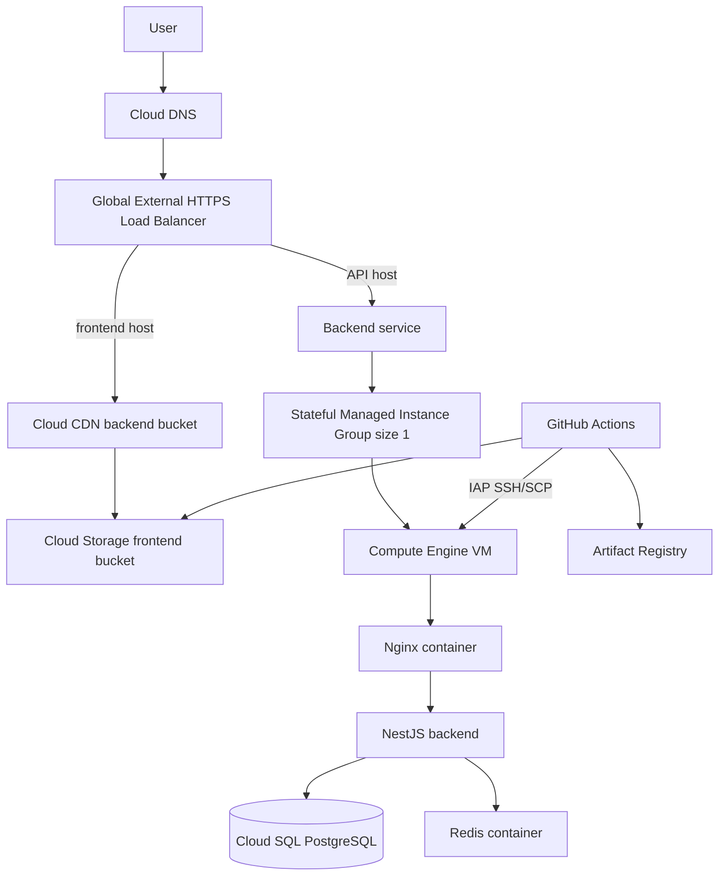

# GCP Platform Baseline

## 1. Status

GCP is the only production infrastructure platform for CMC web02. Repository deployment assets, Terraform, CI/CD, runtime configuration, and rollback procedures must follow this document.

The active environments are:

- `dev`: integration deployment from the `dev` branch
- `prod`: versioned deployment called from a merged `release` pull request after a `v*` tag is created, or manual rollback from `release`

## 2. Source of Truth

```text
docker-compose-prod.yml
nginx/nginx.conf
.github/workflows/deploy-dev.yml
.github/workflows/deploy-prod.yml
.github/scripts/deploy-gcp-backend.sh
terraform/envs/gcp-dev/
terraform/envs/gcp-prod/
terraform/modules/gcp_*/
docs/gcp-dev-deployment-runbook.md
```

Local development continues to use `docker-compose.yml`. Production and shared deployment automation must use `docker-compose-prod.yml`.

## 3. Architecture



### Runtime constraints

- The backend remains a single instance until process-local state is externalized.
- `BattleStateRepositoryAdapter.liveStates`, socket connection maps, timer polling, and the missing Socket.IO Redis adapter block safe horizontal scaling.
- Cloud Run and multi-instance deployment remain deferred until those constraints are resolved.
- Redis runs in the production Compose stack until a separate Memorystore change is approved.
- The size 1 MIG preserves its boot disk so `/opt/cmc`, the runtime `.env`, and Redis AOF survive auto-healing and VM recreation.
- Stateful boot is a lift-and-shift boundary, not a scale-out design. Keep a disk snapshot before policy or template changes.
- Keep `backend_autohealing_enabled = false` until the deployed `/livez` endpoint returns `200`; enable the policy in a second reviewed apply.

## 4. Traffic and TLS

- The Global External HTTPS Load Balancer terminates TLS.
- `nginx/nginx.conf` listens on port 80 inside the backend VM.
- `/healthz` proxies backend readiness and is reserved for the load balancer health check.
- `/livez` proxies dependency-free backend liveness and is used only by MIG auto-healing.
- Readiness runs PostgreSQL `SELECT 1` and Redis `PING`; either dependency failing returns `503` without triggering VM recreation.
- `/api`, `/api/`, and `/socket.io/` are proxied to the backend.
- Other API-host paths return `404`.
- The frontend is served from Cloud Storage through Cloud CDN.
- The backend VM accepts application traffic only from the load balancer proxy and health-check ranges configured by Terraform.
- The load balancer overwrites `X-CMC-Client-IP`; Nginx trusts that header only from the configured Google proxy ranges before applying rate limits.
- Administrative SSH uses IAP TCP forwarding.

## 5. Terraform

### Environments

- `terraform/envs/gcp-dev`
- `terraform/envs/gcp-prod`

### Modules

- `gcp_network`
- `gcp_frontend_storage`
- `gcp_https_lb`
- `gcp_compute_backend`
- `gcp_cloud_sql`
- `gcp_artifact_registry`
- `gcp_secret_manager`
- `gcp_github_actions_identity`
- `gcp_dns`

### State and secrets

- Terraform state uses a versioned GCS backend.
- `terraform.tfvars`, plan files, state files, service account keys, and runtime `.env` files must not be committed.
- Secret Manager resources may be managed by Terraform, but secret payloads must be populated outside Terraform.
- Production Cloud SQL deletion protection remains enabled.

## 6. Deployment Contract

### Backend

1. GitHub Actions authenticates with Workload Identity Federation.
2. Before image build/push, the dev workflow resolves exactly one stable instance from the configured MIG, verifies effective OS Login, opens an IAP SSH session, and confirms that required runtime `.env` keys have non-empty values without printing them.
3. The workflow builds `linux/amd64` images.
4. Images are pushed to Artifact Registry with an immutable version tag.
5. The deploy script repeats the MIG stability and effective OS Login checks immediately before SSH.
6. Compose, Nginx, and monitoring configuration are copied through IAP to an OS Login user-owned staging directory, then promoted with `sudo` without replacing `.env`.
7. The VM authenticates to Artifact Registry with a short-lived access token.
8. Prisma migration runs as a separate Compose tool service.
9. `docker compose up -d --remove-orphans` activates the new version.
10. Nginx config, `/livez`, and `/healthz` must pass before `release.env` is updated.

### Frontend

1. After creating or reusing a version tag for the merged `release` commit, the Version Tag workflow calls the reusable production workflow for that exact commit.
2. The immutable image is stored beside the backend image in Artifact Registry.
3. The workflow extracts fingerprinted files and synchronizes them to Cloud Storage with long-lived immutable cache metadata.
4. `index.html` is uploaded separately and last with no-cache metadata.
5. Automatic release mode builds missing backend/frontend images, while manual rollback uses existing images and never rebuilds the selected release.
6. Cloud CDN serves the bucket through the load balancer.
7. A GitHub Release is created only after production deployment succeeds; reruns reuse the tag and any existing GitHub Release.
8. Merge release pull requests serially, waiting for the preceding Version Tag workflow to finish. The queue preserves pending runs, while the ancestry guard rejects an out-of-order older release instead of deploying it over a newer one.

## 7. GitHub Environments

Create GitHub environments named `dev` and `prod`. Configure the following variables in each environment:

| Variable | Purpose |
| --- | --- |
| `GCP_PROJECT_ID` | GCP project containing the environment |
| `GCP_REGION` | Artifact Registry and compute region |
| `GCP_ARTIFACT_REPOSITORY` | Artifact Registry repository ID |
| `GCP_BACKEND_MIG` | Exact regional MIG name, for example `cmc-dev-backend` |
| `GCP_FRONTEND_BUCKET` | Cloud Storage bucket name without `gs://` |
| `GCP_DEPLOY_PATH` | VM deployment path; `/opt/cmc` is the default |
| `GCP_WORKLOAD_IDENTITY_PROVIDER` | Full Workload Identity Provider resource name |
| `GCP_SERVICE_ACCOUNT` | GitHub Actions deployment service account email |
| `VITE_API_URL` | Public API origin for the environment |
| `VITE_SOCKET_URL` | Public Socket.IO origin for the environment |
| `VITE_ENABLE_SENTRY` | Whether the frontend build enables Sentry |

Configure this build-time value as a repository-level Actions secret. An Environment secret is insufficient because pull request CI and the Version Tag caller are not bound to a GitHub Environment:

- `VITE_SENTRY_DSN`

Pull request CI does not authenticate to or push into a container registry. Its frontend image check uses repository variables `VITE_API_URL`, `VITE_SOCKET_URL`, and `VITE_ENABLE_SENTRY` with the dev public origins, plus the repository `VITE_SENTRY_DSN` secret. GCP deployment jobs use the environment-scoped values above.

Terraform creates one repository-, environment-, and ref-restricted Workload Identity Provider and deployer service account per environment. The deployer uses Artifact Registry writer plus frontend bucket object admin and bucket metadata reader at resource scope, as well as Compute read/OS Login, IAP tunnel, service usage, and target backend service-account-user permissions. Service account JSON keys are forbidden.

GitHub deployment branch policies allow only `dev` for the dev Environment and `release` for prod. The repository ruleset requires pull requests for `release`, and the tag ruleset prevents moving or deleting existing `v*` release tags.

## 8. VM Runtime Secrets

`/opt/cmc/.env` must exist before deployment and lives on the stateful boot disk. At minimum it supplies:

- `GF_SECURITY_ADMIN_PASSWORD`
- `NODE_ENV`
- `FRONTEND_URL`
- `DATABASE_URL`
- `REDIS_HOST`, `REDIS_PORT`
- JWT secrets and expiry values
- OAuth client IDs, secrets, and callback URLs
- Gemini and Sentry values used by the backend

`BACKEND_IMAGE` and `VERSION_TAG` are injected by the deployment workflow and persisted without secret values in `/opt/cmc/release.env` only after health checks pass.

## 9. Rollback

### Backend

- Redeploy the previous backend and frontend immutable Artifact Registry tag through workflow dispatch from the `release` branch.
- The selected tag commit must belong to the `release` history, and both OCI revision labels must equal that commit SHA.
- Manual dispatch must fail before mutation if either artifact is missing.
- If a migration is not backward compatible, follow its documented database recovery procedure before switching the image.

### Frontend

- Extract the selected frontend image and synchronize that exact artifact to the Cloud Storage bucket.
- Upload `index.html` last with no-cache metadata.

### Database

- Use Cloud SQL automated backups or point-in-time recovery according to the incident window.
- Database recovery is independent from application image rollback.

### Infrastructure

- Review the Terraform plan before apply.
- Recover state from GCS object versioning only when state corruption is confirmed.
- Do not roll back infrastructure by manually editing state.

## 10. Verification

```bash
bash -n .github/scripts/deploy-gcp-backend.sh
terraform fmt -check -recursive terraform
(cd terraform/envs/gcp-dev && terraform validate && terraform plan)
(cd terraform/envs/gcp-prod && terraform validate && terraform plan)
pnpm -C backend test
pnpm -C backend build
```

Runtime smoke tests:

- Load balancer `/healthz`
- MIG liveness `/livez`
- Backend `/api` and `/metrics`
- Cloud SQL and Redis connectivity
- OAuth callbacks
- Socket.IO connection and battle flow
- Cloud Storage cache metadata and frontend rendering
- Prometheus, Grafana, and cAdvisor collection

Infrastructure rollout order:

1. Snapshot the current boot disk.
2. Apply WIF/deployer and the stateful MIG change together with `backend_autohealing_enabled = false`.
3. Configure GitHub Environments, enable OS Login on the current VM, and deploy the new backend/Nginx.
4. Verify `/livez` and `/healthz`, then set `backend_autohealing_enabled = true` for a second reviewed apply.
5. Verify preserved state with a dev recreate drill before repeating the two-stage sequence in prod.

## 11. References

- Workload Identity Federation action: <https://github.com/google-github-actions/auth>
- Google Cloud SDK action: <https://github.com/google-github-actions/setup-gcloud>
- Artifact Registry Docker authentication: <https://cloud.google.com/artifact-registry/docs/docker/authentication>
- IAP TCP forwarding: <https://cloud.google.com/iap/docs/using-tcp-forwarding>
- Cloud Storage synchronization: <https://cloud.google.com/sdk/gcloud/reference/storage/rsync>
